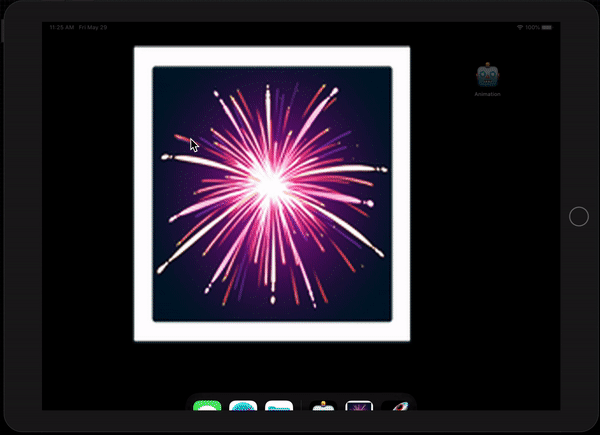

# Fireworks Night

  

 
A game about setting off fireworks.

## Examples within this code
- follow()
- UIBezierPath
- for case let
- Color blending
- Shake gesture

## Demonstration
//TODO Small demonstration as to what the game does when on device.
 

